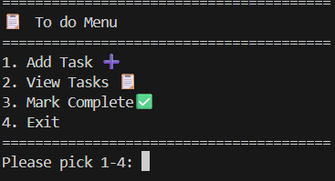
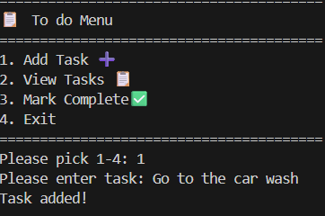
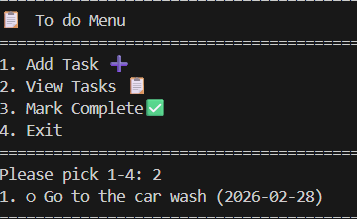
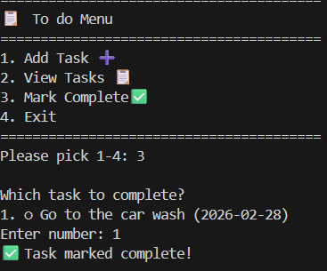
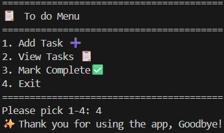

#To do list  

I built this during a Cognitive Class Python for Data Science Module 3 while learning OOP classes.

##What it does
A user can:
>Add tasks
>View message
>Mark a specific task as complete
>Automised datestamps

##What i learnt:
- Making my own "Task" class (kinda cool!)
- How lists hold class objects 
- "while True:" loops for menus
- "print(f"{i}. {task}")" for pretty printing

##Demo 

Musa Mhlambi: IT student from Gauteng aspiring to be a data engineer

